# 算力约束下提升大语言模型能力的资源配置建模

> “华为杯”第二十三届中国研究生数学建模竞赛 · 参赛队号 **26999030003**
> 参赛单位：澳门大学 / 北京师范大学 · 队员：廖启斌、李俊贤、黄孙宏

在统一的可追溯框架下，把 **数据质量、领域配比、参数规模、训练数据量、上下文长度与算法效率** 放进同一条“质量评价 → 配比与 Loss 响应 → 质量扩展标度律 → 算力约束配置 → 能力前沿预测”的模型链，并对每一类结论标注证据等级。

<p align="center">
  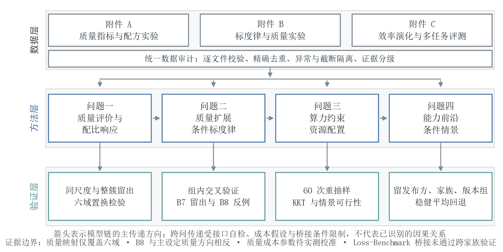
</p>

---

## 一、赛题与解题框架

大语言模型的能力同时受训练数据质量、领域配比、参数规模、数据量、上下文长度与算法效率影响，而题目附件 A / B / C 的**观测单位与证据强度并不一致**：A 族是数据质量信号与配方实验，B 族是标度律与质量实验（部分为半合成），C 族是效率演化与多任务评测。若把不同证据强度的数字直接拼进一个优化目标，很容易得到“看起来精确、实际不可识别”的结论。

因此全文先对全部附件做**逐文件审计、字段校验与异常隔离**，再分层建模，并把结果按证据等级分开报告：

| 证据等级 | 含义 | 典型来源 |
|---|---|---|
| `direct_fit` | 同源数据直接拟合 | B1 标度律参数 |
| `held_out_validation` | 留出 / 整簇留出验证 | Q1 LightGBM、B7-new |
| `semi_synthetic_calibration` | 半合成数据校准 | B6 / B8 质量模型 |
| `scenario_assumption` | 情景假设，非实验识别 | 质量成本函数、λp、η |
| `extrapolation_reference` | 估算参考，不作独立验证 | A12–A15、B10 |

**四问的任务分解：**

| 问题 | 核心任务 | 主输出 |
|---|---|---|
| 问题一 | 数据质量评价 + 领域配比对验证 Loss 的响应 | 分层综合质量分、冻结 LightGBM 配比响应接口 |
| 问题二 | 引入质量变量的条件标度律 | 质量扩展 Loss 模型、质量—参数量替代关系 |
| 问题三 | 算力预算约束下的资源联合配置 | 情景网格最优解、活动约束与结构性转移 |
| 问题四 | 开放权重模型的能力前沿条件预测 | 分轨 12/24 个月情景、Loss–Benchmark 桥接检验 |

---

## 二、问题一：质量评价与配比响应

**数据审计。** A1–A3 共 272,505 条质量信号记录，其中 19 条结构/字段损坏、11 条来源可疑被隔离，11,419 条为可验证精确重复，**有效去重并集 261,056 条**。A1 与 A2 的 arxiv 记录重叠 1,419 条、与 A3 的 github 重叠 10,000 条，因此抽样集与扩展集**不是独立样本**——这一点在报告中始终显式标注。

**分层综合质量分。** 22 项指标先做语义定向与统一分位尺度，再按预设结构分为三个语义组（模型及元评分 8 项、DSIR 分布价值 3 项、语言及文档结构 11 项）：**组间固定等权（各 1/3），组内按熵差异 × Spearman 冗余修正赋权**。这样避免高相关、多指标的 DSIR 族仅凭数量占据全部权重。

| 质量域 | 有效记录数 | 分层主评分 Q<sup>H</sup> | 95% 重抽样区间 |
|---|---:|---:|---|
| stackexchange | 9,998 | **64.82** | [64.71, 64.93] |
| arxiv | 17,523 | 64.20 | [64.06, 64.35] |
| commoncrawl | 9,636 | 63.61 | [63.48, 63.72] |
| c4 | 10,000 | 62.28 | [62.17, 62.38] |
| wikipedia | 9,986 | 60.21 | [60.10, 60.32] |
| github | 203,742 | 54.06 | [54.03, 54.08] |
| book | 171 | 45.85 | [44.31, 47.25] |

<p align="center">
  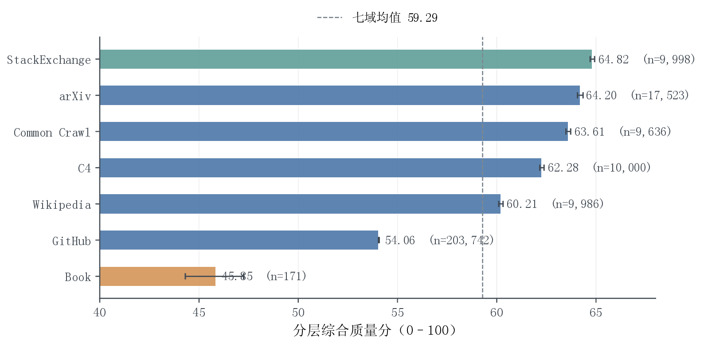
</p>

**配比 → Loss 响应。** 以 17 维领域配比预测 13 个验证域的 Loss，在相同切分下比较参考域参数化 Ridge 与逐目标 LightGBM。冻结 LightGBM 配置为 220 棵树、学习率 0.03、最大深度 4、最多 15 叶、叶节点最少 20 样本，**不使用留出集调参**。

| 验证方式 | Ridge | LightGBM |
|---|---:|---:|
| 训练内重复交叉验证（宏 NRMSE） | 0.6280 | **0.1662** |
| 1M 留出集（宏 NRMSE） | 0.5770 | **0.1309** |
| 1M 留出集（汇总 R²） | 0.5431 | **0.9817** |
| 十簇 GroupKFold（宏 NRMSE） | 0.8532 | **0.2391** |

跨规模只比较配方**排序**（绝对 Loss 存在基线平移）：60M / 1B 真实留出的 13 目标平均 Spearman 为 **0.9836 / 0.9487**，而 10B / 70B 估算表为 0.5411 / 0.4509——后者只能作一致性参考。

**规则敏感性。** 删除四项方向暂定指标后，与主评分的 Spearman 降至 0.8693、Top 1% 重合率仅 0.1536，七个领域中五个名次变化。这说明**领域质量分描述的是“在给定评价规则下哪些指标组合更突出”，不能脱离规则称为领域的客观质量真值**。

<p align="center">
  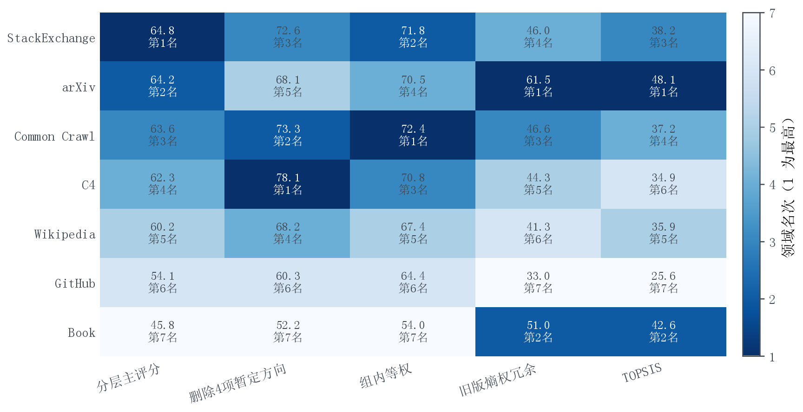
</p>

---

## 三、问题二：质量扩展的条件标度律

**经典基准。** 在 B1 的 1,176 个同体系检查点上拟合 `L₀(N,D) = E + A·N^(−α) + B·D^(−β)`：

```
E = 1.68980   A = 0.35398   α = 0.33998   B = 1.24031   β = 0.27988
```

按模型规模整组留出的八折检验中最大 RMSE 为 2.2023×10⁻⁴。相邻检查点存在轨迹相关性，故**不采用随机行切分**。

<p align="center">
  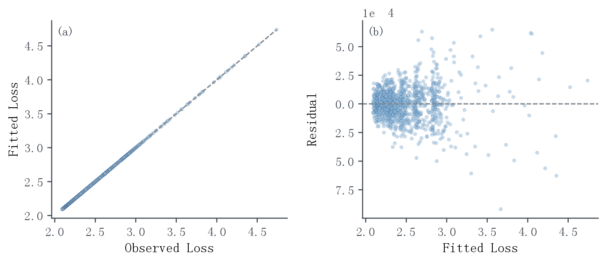
</p>

**质量通道。** 用固定 (N, D) 下质量层级间的损失振幅定位质量作用通道，B6/B7 半合成网格的合并诊断为 `log A_Q = −0.7837 − 0.1431·log N − 0.0546·log D`（N 指数 p = 1.3×10⁻¹⁵），支持同时检查**容量通道与数据通道**。由此构造通道—加性质量模型：

```
L_Q(N, D, Q_B) = Ẽ + ÷N^(−α)·e^(−ρ_N·Q_B) + B̃·D^(−β)·e^(−ρ_D·Q_B) − E₁·Q_B
```

| 数据层 | 无质量基线 RMSE | 质量模型 RMSE | 证据等级 |
|---|---:|---:|---|
| B6 组交叉验证 | 0.12876 | **0.07609** | 半合成校准 |
| B7-new 新质量水平留出 | 0.05896 | **0.04909** | 留出验证 |

同一半合成机制附近加入质量项能降低预测误差。**B8 的 150/150 个固定组呈现与 B6/B7 相反的质量—Loss 方向**，故单独列为方向压力测试，不并入重新估计、也不反转质量语义。

<p align="center">
  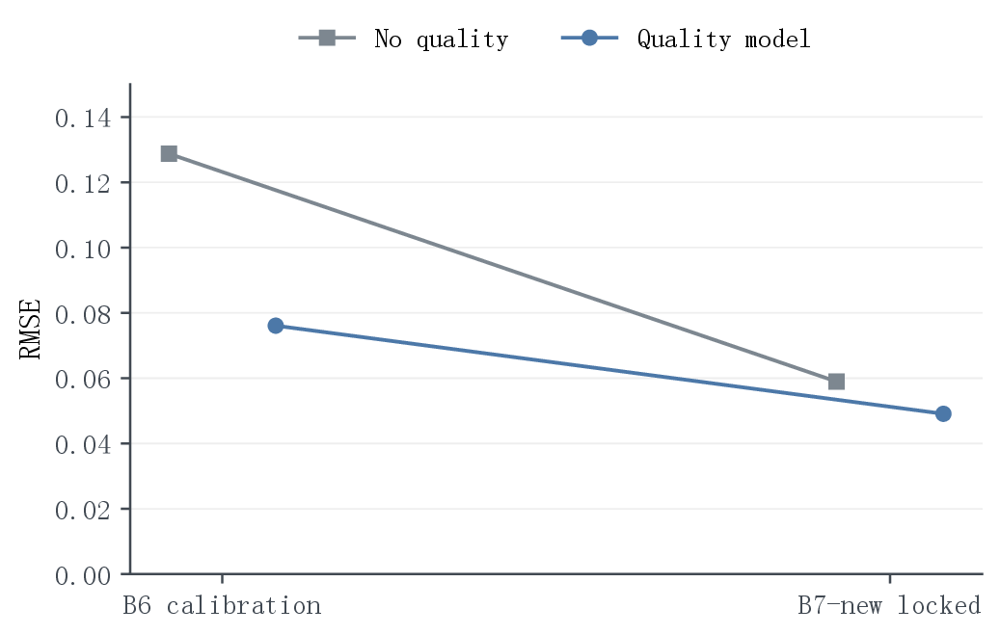
  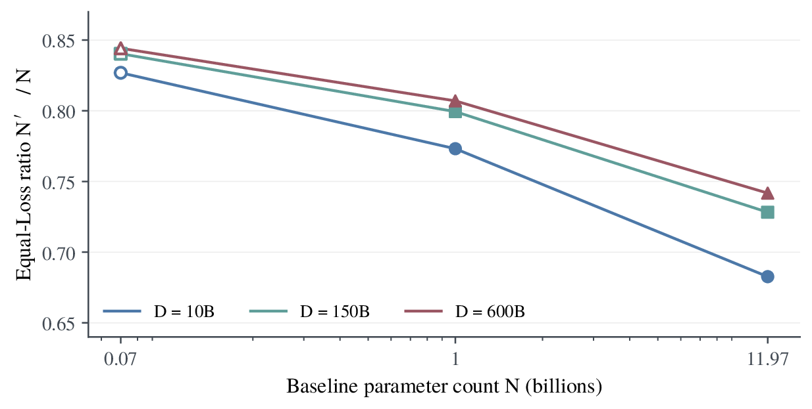
</p>

**质量替代与等算力比较。** 在代表工作点 (N = 1B, D = 150B, Q_B = 0.5) 上把质量提到 0.6，等损失反解得到 N₁ = 0.7994B，即该函数下的局部条件替代量约 **0.2006B 参数**。按三种预设质量成本函数做等算力比较，提质/扩模的预测改善比分别为 11.2（指数型）、5.4（幂函数型）、4.1（对数渐进型）——但**成本函数并非来自实际账单**，因此只作指定参数下的算力情景。

---

## 四、问题三：算力约束下的资源联合配置

把问题二主模型写成等价形式后（E = 0.909046, A = 0.540173, B_eff = 2.103696, α = 0.279054, β = 0.099598, ρ_D = 0.317893, ρ_N = E₁ = 0），在总算力预算下优化参数量 N、数据量 D 与质量水平 Q：

```
C_use = 6ND + η·N·D·ℓ + D·[g(Q) − g(Q₀)]₊  ≤  C
```

其中 η ∈ {10⁻⁴, 2×10⁻⁴, 4×10⁻⁴}、ℓ ∈ {2048, 4096, 8192, 32768, 131072}、g(Q) 取三种预设质量成本；优化盒与 B6 支持范围一致（0.07 ≤ N ≤ 11.97 B，10 ≤ D ≤ 600 B，0.5 ≤ Q ≤ 1）。三档 η × 五档上下文 × 三种质量成本 × 三档预算 = **135 个情景，其中 123 个可行**；默认 η = 2×10⁻⁴ 的 45 个主情景中 42 个可行。

| 预算 FLOPs | N (B) | D (B) | Q_B | 预测 Loss | 闲置率 | 活动约束 |
|---|---:|---:|---:|---:|---:|---|
| 10¹⁹ | 0.07695 | 10.000 | 0.52607 | 3.42899 | 0.00% | D 下界 |
| 10²² | 6.29402 | 120.706 | 1.00000 | 2.18204 | 0.00% | Q 上界 |
| 10²⁴ | 11.97000 | 600.000 | 1.00000 | 1.98876 | 90.75% | 支持盒上界 |

<p align="center">
  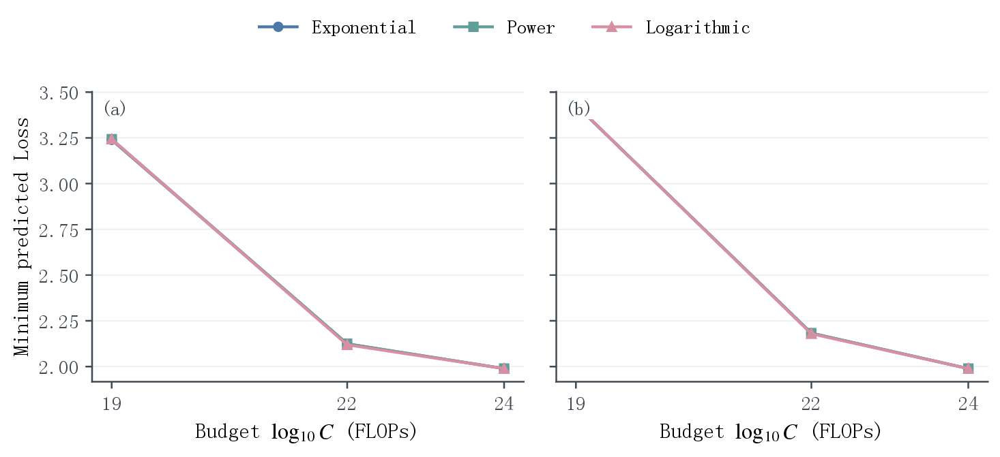
  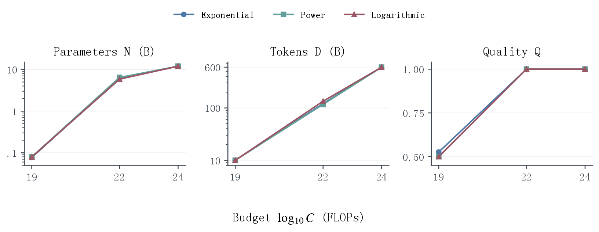
</p>

**结构性转移。** 用活动状态向量 **s(C) = (s_N, s_D, s_Q, s_idle)** 沿 10¹⁹ → 10²² → 10²⁴ 比较，识别出可复核的转移路径：低预算受 **D 下界**约束 → 中预算转为 **Q 上界**约束 → 高预算 **N, D, Q 同时到达支持盒上界**并出现显著闲置（中位闲置率 94.28%）。因此“预算增加但 Loss 不再明显下降”首先是**支持盒截断**，而不是真实系统已无可用扩展方向。

<p align="center">
  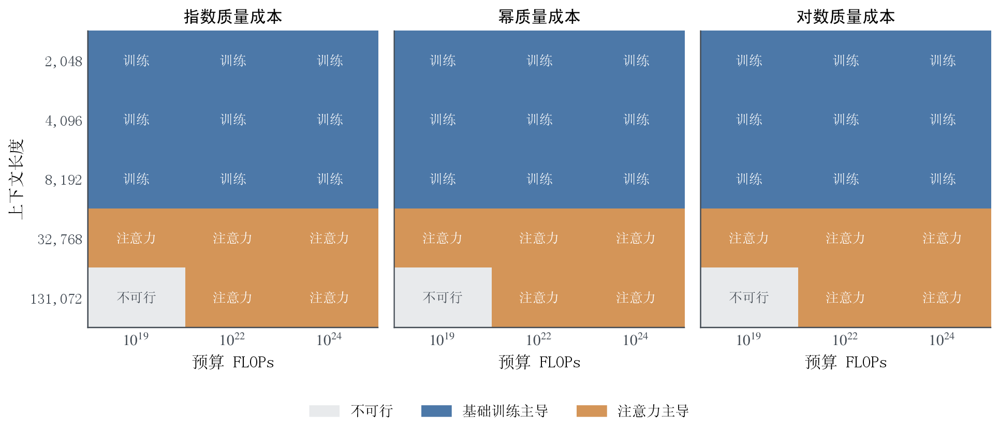
</p>

上下文成本与预算无关，却完全依赖未校准的 η：由 `C_attn / C_train = ηℓ / 6` 得临界长度 `ℓ_crit = 6 / η`，三档 η 对应 60 000 / 30 000 / 15 000 token。**60/60 次组重抽样传播与 9/9 个局部数值/KKT 检验全部通过**；代表工作点的总 Loss 预算弹性 ε_C = −0.04334897，作为问题四机制腿的跨问输入。

<p align="center">
  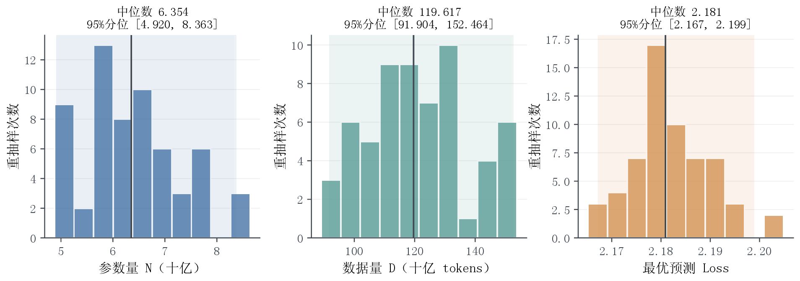
</p>

> 关键提醒：N 与 D 的分布宽度明显大于最优 Loss 的宽度——不同资源组合可以落在相近的 Loss 等高线上，**“预测性能较稳定”并不意味着“资源配比唯一”**。

---

## 五、问题四：能力前沿的条件情景预测

**主样本筛选。** 按 O = W ∩ V ∩ E ∩ T 规则联查开放权重、固定版本、C8 评测 JSON 与任务协议：424 个权重候选归并为 420 个不同名称，54 个候选具有官方 SHA 证据，最终主样本为 **34 个固定版本（pretrained 14 / chat-finetuned 20），覆盖 15 个发布方**；另保留 182 个辅助记录但不混入主样本。C8 共 1,958 个物理 JSON、分布于 1,863 个目录，固定选档后得到 1,860 份有效记录。

**能力度量**为 IFEval、BBH、MATH、GPQA、MUSR、MMLU-Pro 六项任务的等权宏平均，前沿以任务内季度第 90 百分位描述。

<p align="center">
  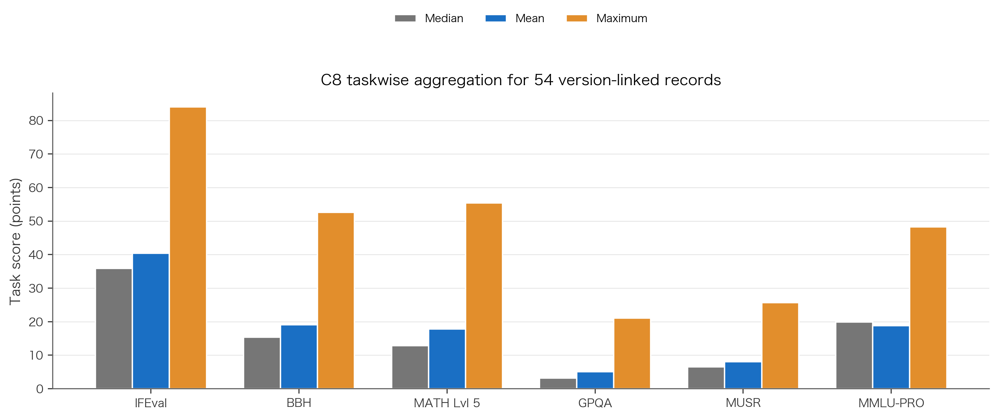
</p>

**留组验证与回退。** 三种候选模型在留发布方 / 留家族代理组 / 留近期版本组上的外层 MAE：

| 候选模型 | 留发布方 | 留家族代理组 | 留近期版本组 |
|---|---:|---:|---:|
| 辅助样本动态 | **6.3153** | 5.6672 | 7.5008 |
| 主样本动态 | 9.0710 | 6.2869 | **7.2286** |
| 主样本规模 | 8.7137 | 6.0105 | 7.2872 |
| 常数基线 | 8.7973 | 9.2398 | 9.3250 |

稳健平均权重为 0.49 / 0.06 / 0.45，但它在留发布方上的 MAE 为 8.8694，比该切分最佳单模型高 40.44%，最大权重四分位距 0.5425。依预定回退规则**不采用不稳定的平均模型，回退到主样本动态候选**。

<p align="center">
  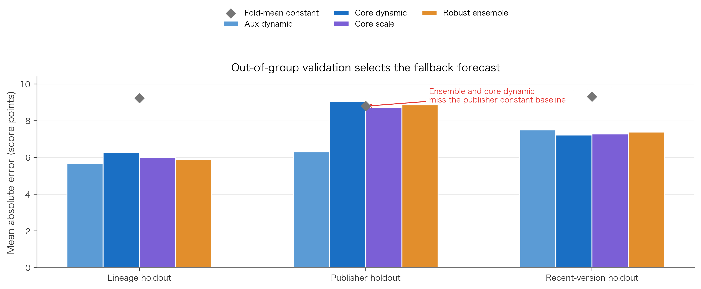
</p>

**条件归因。** 按 ΔS_obs = ΔS_N + ΔS_t + ΔS_mix 记账，当前对齐样本的点分解为 **0.879572 / 2.302270 / 7.304008**，观察差 10.485849 分。仅保留“规模 + 时间”的子模型中两项份额为 27.64% / 72.36%，而跨 27 个合法规格的规模贡献敏感性范围为 **11.10% – 97.55%**——说明分解强依赖时间轴、样本与控制项设定，**不能命名为纯算法进步**。

**分轨前沿情景。** 以 2025-03-13 为锚点：

| 轨道与期限 | 条件点值 | 规格下界 | 规格上界 |
|---|---:|---:|---:|
| Pretrained，12 个月 | 37.3107 | 33.314 | 42.096 |
| Pretrained，24 个月 | 41.2719 | 33.962 | 51.133 |
| Chat/finetuned，12 个月 | 38.5715 | 34.515 | 43.407 |
| Chat/finetuned，24 个月 | 42.5756 | 35.173 | 52.470 |

<p align="center">
  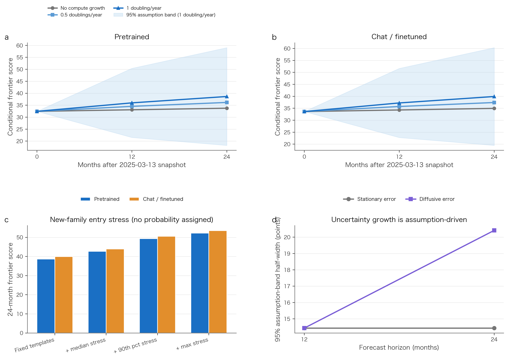
</p>

表中包络是 **27 种预设合法规格下的情景范围**，不是已校准覆盖率的置信区间；历史回测最长仅覆盖 1–3 个月，故不宣称 12/24 个月预测已被验证。

**Loss–Benchmark 桥接未通过。** C5 候选仿射式 `LB = 48.92927 − 14.52873·L` 样本内 R² = 0.2398，留一模型家族 MAE 为 8.0583，**略差于常数基线 7.9996（技能分数 −0.7%）**；C6 与 C5 存在嵌套，不能视作独立确认。因此本章**不把训练 Loss 换算成确定的 Benchmark 分数**。

<p align="center">
  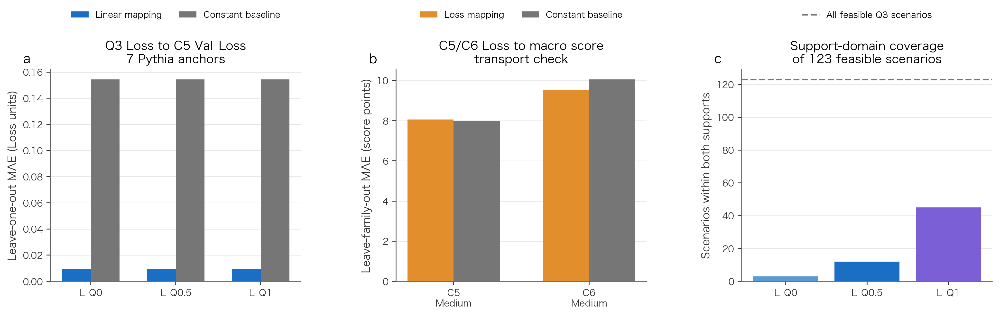
</p>

---

## 六、仓库结构

```
.
├── README.md                    本文件
├── paper/                       最终版论文（PDF）
├── figures/                     论文正文使用的 27 张图（PNG，由 PDF 矢量源渲染）
├── code/
│   ├── src/                     四问正式流水线源码（Q1 质量与配比、Q2 标度律、Q3 配置、Q4 前沿）
│   ├── configs/                 四问运行配置
│   ├── tests/                   单元与流水线测试
│   ├── analysis/                121 个核验 / 敏感性 / 绘图脚本
│   └── requirements.txt
├── interfaces/                  跨问冻结接口（SHA-256 已逐位比对）
├── results/
│   ├── q1/  问题一：质量评分、冲突消解、配比验证、模型指标
│   ├── q2/  问题二：B1 标度律、B6/B7 质量模型、弹性网格、证据分级表
│   ├── q3/  问题三：135 情景网格、KKT 复核、机制弹性
│   └── q4/  问题四：分轨预测、C8 审计、开源筛选与回退诊断
└── docs/                        数据附件索引与复现说明
```

---

## 七、复现指南

四问为**顺序依赖**：Q1 产出配比响应接口 → Q2 消费该接口并产出 MQ 主模型 → Q3 消费 Q2 主模型 → Q4 消费 Q3 最新资源前沿。

```bash
pip install -r code/requirements.txt

# 需将 code/ 目录映射为仓库布局后执行：
#   code/src → src/    code/configs → configs/    code/tests → tests/

PYTHONPATH=src python -m src.q1_revision_v2_1.cli         # 问题一
PYTHONPATH=src python -m src.q2_fusion_rerun --stage all  # 问题二
PYTHONPATH=src python -m src.q3_latest.pipeline           # 问题三
PYTHONPATH=src python -m src.q4_latest.pipeline           # 问题四
```

每个正式结果目录内均含 `metadata.json`（版本、随机种子、代码与配置哈希）与 `report.md`，用于回溯口径。附件数据的路径映射与来源清单见 [docs/数据与复现说明](docs/数据与复现说明.md)。

---

## 八、证据纪律（重要）

本项目的所有结论都受以下约束，报告中亦逐条标注：

1. **半合成数据须标注**：B2、B6、B7、B8 为半合成校准 / 压力数据，不得表述为直接实验观测。
2. **估算数据不得当真值**：A12–A15、B10 的 Loss 为既有估算参考，不构成独立验证。
3. **情景参数不得当作优化变量**：λ_p（配比迁移系数）、质量成本函数 g(Q)、η 均未被联合实验识别，只能以情景族 + 包络形式报告。
4. **接口一致性优先**：跨问数值一律引用 `interfaces/` 的冻结件，不引用历史版本。
5. **口径不可唯一识别的量**：如 g_N（参数年对数增长率）需报区间或敏感曲线，不报单点结论。
6. **上下文长度不是自由寻优变量**：ℓ 取 C7 支持范围内的外生候选，只做情景敏感性。
7. **逐任务结果不忽略**：宏平均之外同时报告逐任务指标与方向冲突。
8. **损失到评测的桥接要分层**：Q2/Q3 的 Loss 与 Q4 的 Benchmark 分数不直接拼接。

---

## 九、技术栈

- **建模**：分层熵权 / Spearman 冗余修正、岭回归、LightGBM、幂律标度律、KKT 与数值优化、分位前沿与分位数回归
- **验证**：域内重抽样、按规模/簇/发布方/家族的留组验证、区块 Bootstrap、置换检验、有限差分与活动约束识别
- **工程**：Python（NumPy / pandas / scikit-learn / LightGBM / Matplotlib）、YAML/JSON 配置与哈希冻结、逐文件 SHA-256 完整性校验

---

*本项目为竞赛作品集归档。论文、代码、接口与结果数据的完整交付清单与哈希见 [docs/数据与复现说明](docs/数据与复现说明.md)。*
